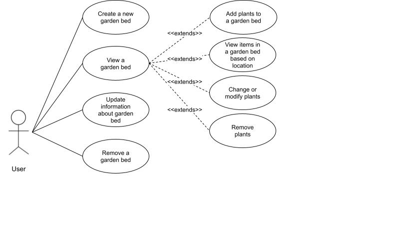

## About the project

1. **What is the task?** Menu driven program demonstrating CRUD functions
2. **What was learned?** What kind of struggles?

## Use Case Diagram
*As a user...*

### Garden Bed
- create a new garden bed
- specify size
- view a garden bed
- update information about the garden bed
- remove a garden bed

### Plants in a Garden
- add plants to a garden bed
- view the plants in a garden bed
- view information about a plant
- change or modify the plants
- remove plants from the garden

## Class Diagram

 
