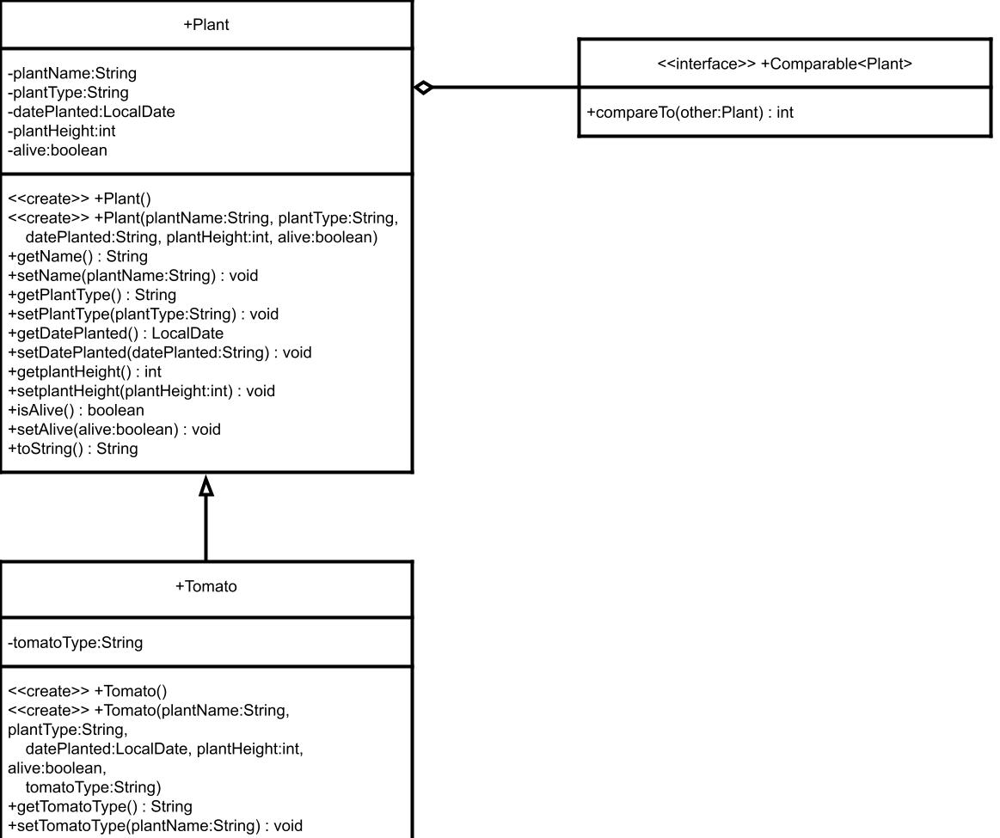

## About the project

1. **What is the task?** Menu driven program demonstrating CRUD functions
2. **What was learned?** What kind of struggles?

## Use Case Diagram
*As a user can...*

### Garden Bed
- add a plant to a garden
- view plants in a garden
- update a plant as not alive
- remove a plant from the garden

### View Plants
- alphabetically by name
- that are alive
- by date planted
- by height

## Class Diagram

 
 
